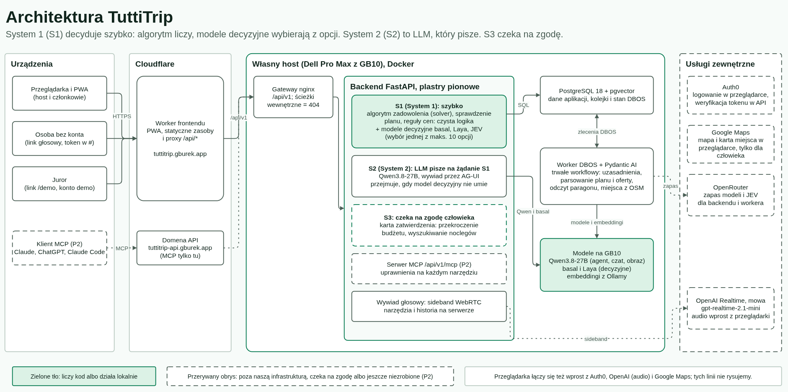

# Architektura TuttiTrip: decyzje, modele i mapa

Ten dokument zbiera decyzje architektoniczne zespołu z powodami i z odnośnikami do issues i PR, w których zapadły albo zostały wdrożone. Kod i reguły każdej części są w jej własnym repozytorium (`AGENTS.md`, `deploy/CONVENTIONS.md`), a specyfikacja planowania w [docs/algorytm.md](https://github.com/HackYeah-TuttiTripTeam/tuttitrip-backend/blob/develop/docs/algorytm.md) (rdzeń pomysłu, ma pierwszeństwo nad wszystkim innym). Zgłoszenie źródłowe: [tuttitrip#17][tt#17].

Status przy każdej decyzji znaczy: **zrobione** (zmergowane do `develop`), **w trakcie** albo **w backlogu** (issue otwarte). Niczego, co jest w backlogu, nie opisujemy jako działającego.

## Zasada przewodnia: S1, S2, S3

Diagram jest w draw.io: [architektura.drawio](diagramy/architektura.drawio), generuje go [architektura.py](diagramy/architektura.py).

| Warstwa | Co robi | Czego nie robi |
| --- | --- | --- |
| **S1** (System 1, szybko) | Algorytm zadowolenia i sprawiedliwości (solver), sprawdzenie planu (linter), reguły cen, wymagania noclegowe i rozliczenie jako czysta logika w `logic/`, oraz małe modele decyzyjne (basal i Laya na GB10, JEV przez OpenRouter), które w ułamku sekundy wybierają jedną z najwyżej 10 podanych opcji. | Nie pisze tekstu. Algorytm nie woła żadnego modelu, frameworka webowego ani bazy, a model decyzyjny niczego nie liczy, tylko klasyfikuje. |
| **S2** (System 2, LLM) | Model językowy (Qwen3.8-27B) pisze treść tylko na żądanie S1: pytania wywiadu, uzasadnienia werdyktów, odczyt wklejonego planu, oferty i paragonu. Przejmuje wybór, którego model decyzyjny nie umie zrobić (eskalacja do `tuttitrip:chat`). | Nie decyduje o żadnej liczbie ani o werdykcie. |
| **S3** | Działania, które kosztują albo wychodzą poza plan, czekają na zgodę człowieka na karcie zatwierdzenia: zgoda na przekroczenie budżetu ([be#53][be#53]), otwarcie wyszukiwania noclegów ([be#69][be#69]). | Nie wykonuje się samo. |

Nazwy nawiązują do Systemu 1 i Systemu 2 Kahnemana: S1 to szybka, prosta decyzja, S2 wolniejsze myślenie. Liczby w planie zawsze liczy algorytm z S1.

Dowód S1: po wyłączeniu modeli algorytm, linter i reguły cen nadal działają, a ich wynik da się powtórzyć (ten sam plan ma ten sam skrót, [be#47][be#47]) i zmierzyć ([be#76][be#76]). Granice pilnują testy architektury w backendzie ([AGENTS.md backendu](https://github.com/HackYeah-TuttiTripTeam/tuttitrip-backend/blob/develop/AGENTS.md), „Dependency rules”): moduły `logic/` i `schemas.py` nie sięgają do `fastapi`, `pydantic_ai`, `sqlalchemy` ani `httpx`, nawet pośrednio.

## Decyzje D1 do D7

| | Decyzja | Powód | Status i odnośniki |
| --- | --- | --- | --- |
| **D1** | Solver i logika S1 w backendzie jako czysta logika, wołana poza pętlą zdarzeń. Heurystyka najpierw, CP-SAT jako podmiana za tym samym interfejsem. | Powtarzalny plan to jedna z trzech liczb dla jury, a jeden solver dla `n ≥ 1` daje mniej kodu i spójność wyniku solo z wynikiem grupy. Pętli zdarzeń nie blokujemy (`anyio.to_thread.run_sync`). Specyfikacja (sekcja 9) dopuszcza wyszukiwanie lokalne, a CP-SAT z linearyzacją logarytmu produkcyjnie. Worker nie liczy algorytmu, tylko dostarcza jego wejścia ([AGENTS.md workera](https://github.com/HackYeah-TuttiTripTeam/tuttitrip-worker/blob/develop/AGENTS.md)). | Harmonogram dnia zrobiony ([be-pr#151][be-pr#151]), kontrakt planu zrobiony ([be-pr#112][be-pr#112]). Solver w backlogu: [be#47][be#47], podmiana CP-SAT: [be#92][be#92]. Specyfikacja: [be#27][be#27]. |
| **D2** | Wywiad tekstowy w backendzie przez AG-UI. Wyjątek w testach architektury: `pydantic_ai.ui.ag_ui` wolno importować tylko w `interview/api.py`, a we frontendzie `@ag-ui/client` i `@copilotkit/*` są dozwolone. | Pełna zgodność z protokołem AG-UI (zdarzenia ze specyfikacji 1.0, narzędzia frontendu od klienta) bez własnego formatu obok. Spike potwierdził, że strumień idzie na żywo przez nginx, Cloudflare i Worker frontendu, a klient 1.0.1 czyta zdarzenia serwera. Wyjątek jest wąski: reguła „tylko `services` importują `pydantic_ai`” wyklucza ten jeden moduł, a import adaptera gdziekolwiek indziej nadal łamie testy (sprawdzone na celowych naruszeniach). | Spike i decyzja: [fe#24][fe#24] (podgląd [fe-pr#73][fe-pr#73], nie do mergowania). Endpoint: [be#56][be#56], w backlogu. Komponenty wywiadu: [fe#42][fe#42]. Na dziś frontend używa własnych komponentów i `@ag-ui/client`; CopilotKit zostaje dozwolony w wyjątku, ale go nie potrzebujemy. |
| **D3** | Głos przez Pydantic AI Realtime w chmurze na `gpt-realtime-2.1-mini`: WebRTC z przeglądarki do OpenAI, sideband na backendzie z tymi samymi narzędziami co wywiad tekstowy, transkrypcja wejścia `'auto'`. Klucz OpenAI tylko do realtime, z limitem wydatków. | Speech-to-speech bez osobnego STT i TTS (R3). Dźwięk idzie wprost do OpenAI, a klucz, narzędzia i historia zostają na serwerze. Limit kosztu rozmowy i czasu (`UsageLimits`) oraz limit wydatków w panelu OpenAI ograniczają koszt w razie błędu albo wycieku klucza. | W backlogu: [be#61][be#61], strona frontendu [fe#46][fe#46]. Model widoczny dla naszego klucza (test zespołu 3.10.2026), samej sesji jeszcze nie testowano. |
| **D4** | Dostęp bez konta (link głosowy, link dla jury) przez znacznik dostępu tokenem obok `requires()` i `public()`. | Babcia z linkiem ma dostać jedną wąską funkcję na jednym profilu jednego wyjazdu, bez otwierania tras publicznych. Reguła architektury zmienia się świadomie, w tym samym PR, który dodaje znacznik. Szczegóły wzorca niżej, w części „Token w linku”. | Znacznik zrobiony: [be-pr#120][be-pr#120] (issue [be#79][be#79]). Zaproszenia: [be-pr#140][be-pr#140]. Wejście jury: [be-pr#148][be-pr#148], [fe-pr#103][fe-pr#103]. Link głosowy: [be#80][be#80], [fe#53][fe#53], w backlogu. |
| **D5** | Domena `places`. „Zweryfikowane” ceny i godziny pochodzą z naszego arkusza i z OSM. Z Google trzymamy tylko `google_place_id`. | Każda cena i godzina ma źródło, datę sprawdzenia i znacznik `verified`, więc żadna wartość nie pochodzi po cichu z modelu ani z danych, których warunki Google zabraniają używać w algorytmie. Dane z OSM są zawsze niezweryfikowane (`source = osm`, `hours_verified = false`), a algorytm zawyża niezweryfikowaną cenę o 15% (δ w E6). | Domena zrobiona: [be-pr#113][be-pr#113]. Kandydaci z OSM: [wk-pr#41][wk-pr#41]. Import czterech miast z arkusza: [be#37][be#37], w backlogu. |
| **D6** | Mapa bazowa Google Maps (Maps JavaScript API) i karta miejsca z Places UI Kit jako informacja dla człowieka. Danych Places API nie używamy w algorytmie ani w linterze. Ochrona kosztów: kwoty dzienne poniżej darmowych limitów, klucz ograniczony do dwóch API i naszych domen, alerty budżetu 10, 25 i 40 USD. | Warunki EOG, patrz część „Mapa Google”. Budżet w Google Cloud tylko wysyła alert, niczego nie blokuje, więc o kosztach decydują kwoty i ograniczenia klucza. | W backlogu: [be#28][be#28] (infra), mapa dnia [fe#32][fe#32], karta miejsca [fe#41][fe#41]. |
| **D7** | Serwer MCP w backendzie pod `/api/v1/mcp` (FastMCP, Streamable HTTP, tryb bezstanowy), osobne API w Auth0 dla main i develop, uprawnienie `Feature` i dostęp do podróży na każdym narzędziu, jawne wyjątki w `test_routes.py` i `test_permissions.py`. MCP tylko na hoście API. Milestone na końcu (P2). | R5: użytkownik podłącza TuttiTrip do Claude, ChatGPT albo innego klienta MCP. Narzędzie sprawdza te same uprawnienia co endpoint, więc MCP nie jest tylnymi drzwiami. Testy odrzucały dotąd każdą trasę, która nie jest `APIRoute`, więc zmieniamy je tak, by dopuszczały tylko serwer MCP i metadane zasobu, a każde narzędzie musi mieć dokładnie jeden `mcp_requires`. | W backlogu (P2): konfiguracja Auth0 [be#102][be#102], serwer [be#103][be#103], podłączenie klientów [be#104][be#104], narzędzia [be#105][be#105] i [be#106][be#106]. |

## Wzorce w kodzie

### Plastry pionowe i znaczniki dostępu

- Backend dzieli się na domeny (`trips`, `profiles`, `interview`, `planning`, `accommodation`, `expenses`, `search`, `places`) i `shared`. Każda domena ma stały zestaw plików (`api.py`, `schemas.py`, `services/`, `models.py`, `db.py`, opcjonalnie `logic/`), a test `test_domain_contains_only_known_files` odrzuca inne ([commit restrukturyzacji](https://github.com/HackYeah-TuttiTripTeam/tuttitrip-backend/commit/f5b85f8)).
- Domena importuje inną tylko przez jej `services` lub `schemas`; jedyny wyjątek to zależności HTTP między plikami `api.py` (np. `TripAccess`). `shared` nie importuje domen.
- Każdy endpoint ma dokładnie jeden znacznik w `dependencies`: `requires(Feature.X, Access.Y)`, `public()` albo `token_access(...)`. Test `test_permissions.py` przechodzi po wszystkich trasach i nie przepuści trasy bez znacznika, z dwoma znacznikami ani ze stringiem zamiast `Feature.X`. Uprawnienia do funkcji tworzą drzewo `READ`/`WRITE` ([be-pr#20][be-pr#20]), a dostęp do konkretnego wyjazdu to osobna warstwa: rola `member < co_host < host` przez `TripAccess` (cudzy wyjazd daje 404, za niska rola 403).
- Frontend ma własne reguły (widoki nie importują widoków, `components/` są prezentacyjne, trasy importują tylko widoki i loadery), sprawdzane przez dependency-cruiser i Biome ([AGENTS.md frontendu](https://github.com/HackYeah-TuttiTripTeam/tuttitrip-frontend/blob/develop/AGENTS.md)).

### Token w linku

Wzorzec dla każdego dostępu bez konta (link głosowy, zaproszenie, wejście jury):

1. Token to 32 losowe bajty (`secrets.token_urlsafe`). W bazie jest tylko jego SHA-256, więc wyciek tabeli nie daje działających linków. Lookup po haszu jest porównaniem, a atak czasowy nie ma sensu przy 256-bitowym losowym tokenie.
2. Token siedzi we **fragmencie URL** (`#t=...`), nigdy w ścieżce ani query, więc nie trafia do logów serwera ani nagłówka `Referer`. Frontend czyta fragment, usuwa go z paska adresu i wysyła token w nagłówku `X-Access-Token` albo w ciele żądania. Test pilnuje, że żadna trasa nie ma parametru `token` w ścieżce.
3. Każdy zły token (nieznany, wygasły, odwołany, wyczerpany, z innym zakresem) daje to samo `404`, a odpowiedzi mają `Cache-Control: no-store`. Dzięki temu nie da się sprawdzić, który token istnieje.
4. Token widać jeden raz, w odpowiedzi tworzącej. Nie logujemy go i nie wkładamy do wyjątków. Walidacja nie odbija wartości w błędzie 422.
5. Token daje jeden zakres (`TokenScope`) na jednym profilu jednego wyjazdu. Nowy zakres nie wymaga migracji, a nowa trasa tokenowa trafia na listę w teście architektury.

Źródła: [be-pr#120][be-pr#120] (znacznik), [be-pr#140][be-pr#140] (zaproszenia `/join#t=`), [be-pr#148][be-pr#148] (jury `/demo#t=`), [AGENTS.md backendu](https://github.com/HackYeah-TuttiTripTeam/tuttitrip-backend/blob/develop/AGENTS.md), sekcja „Uprawnienia”.

### Zasada Lists

Każdy endpoint zwracający kolekcję jest po stronie serwera stronicowany, filtrowany i sortowany. Odpowiedź to `Page[T]` (`items`, `total`, `page`, `size`, `pages`), zapytanie ma `page`, `size` (domyślnie 20, maks. 100), `sort` (enum na endpoint, mapowany na kolumny w `db.py`, z `id` jako ostatnim kluczem), `dir` i typowane filtry zadeklarowane raz. Operacja zbiorcza bierze albo identyfikatory (maks. 100), albo ten sam model filtrów, nigdy oba, i zawsze w zakresie wołającego. Test `test_lists.py` ma listę wyjątków, która może się tylko kurczyć. Powód: żadna lista nie rośnie bez limitu, a stan listy da się wskazać linkiem. Backend: [be-pr#141][be-pr#141] (issue [be#132][be#132]). Frontend trzyma stan listy w parametrach URL ([fe#81][fe#81], [fe#89][fe#89], w backlogu).

### Worker DBOS z Pydantic AI

- Backend nigdy nie wykonuje workflowów. Zleca je przez `DBOSClient` (kolejka w Postgresie) i czyta status, wyniki i zdarzenia. Worker robi długie operacje: agenci Pydantic AI, embeddingi, odczyt dokumentów, kandydaci miejsc, reset konta demo. Po restarcie kończy zadanie od ostatniego kroku i nie powtarza udanych wywołań modelu.
- Kontrakt zadań (nazwy workflowów i kolejek, ładunki, `CONTRACT_VERSION`) jest kanoniczny w workerze, a backend trzyma lustro. CI w obu repozytoriach porównuje `contracts/jobs.schema.json`. Zmiana niezgodna idzie w trzech krokach (worker przyjmuje starą i nową wersję, backend podnosi wersję, worker porzuca starą).
- Ładunki to mały, przenośny JSON (`serialization_type=PORTABLE`), bo pickle wymagałby tych samych klas Pythona po obu stronach. Identyfikator workflowu jest deterministyczny, więc powtórzone żądanie zwraca to samo zadanie. Wersja aplikacji DBOS to nazwa środowiska, więc worker bierze tylko zadania swojego środowiska.
- Backend jest właścicielem całego DDL (Alembic i `dbos migrate`). Worker ma rolę `tuttitrip_worker` bez DDL i z listą tabel do zapisu w `deploy/worker-grants.sql`.
- Workflow jest deterministyczny, a każde wywołanie modelu, HTTP i zapytanie do bazy to osobny krok `@DBOS.step`. Agent ma `DBOSDurability()` i jest wołany wewnątrz workflowu. Modele przechodzą granicę kroku jako teksty (identyfikatory katalogu), nie jako obiekty.
- Kolejki: `default` (współbieżność 8), `local_llm` (2, bo to jedno GPU) i `openrouter` (8, najwyżej 30 startów na 60 s). Worker co ok. 30 s zapisuje heartbeat, a `/api/v1/health` pokazuje `worker: ok|stale|missing`; endpointy zlecające odpowiadają 503, gdy workera nie ma.

Źródła: [wk-pr#30][wk-pr#30] (katalog modeli), [wk-pr#31][wk-pr#31] (workflowy), [be-pr#119][be-pr#119] (lustro kontraktu), reguły w [AGENTS.md workera](https://github.com/HackYeah-TuttiTripTeam/tuttitrip-worker/blob/develop/AGENTS.md) (sekcja „DBOS rules”) i w [deploy/CONVENTIONS.md](https://github.com/HackYeah-TuttiTripTeam/tuttitrip-backend/blob/develop/deploy/CONVENTIONS.md) (sekcja „Integracja z workerem”).

### Cloudflare Workers i PWA

- Frontend to PWA na Cloudflare Workers: statyczne zasoby plus skrypt, który przekazuje `/api/*` do backendu swojego środowiska. Aplikacja woła API pod własną domeną, więc nie potrzebuje CORS, a ten sam build działa w każdym środowisku ([fe-pr#22][fe-pr#22]).
- Skrypt Workera idzie pierwszy dla `/api/*` i `/assets/*`. Warstwa zasobów sama oddaje `index.html` z kodem 200 dla każdej brakującej ścieżki, więc brakujący plik `/assets/x.js` bez Workera daje błąd MIME i pustą trasę. Dlatego brakujący plik w `/assets/*` jest prawdziwym 404.
- Decyzje cache z [fe-pr#95][fe-pr#95] (bug [fe#93][fe#93]): `skipWaiting` i `clientsClaim` jawnie, jedno przeładowanie po przejęciu kontroli przez nowy service worker, `index.html` nigdy w precache, przeładowanie raz po błędzie ładowania chunka (z ochroną przed pętlą 30 s). Produkcja (`main`): nawigacje `NetworkFirst`, precache zasobów, `/assets/*` niezmienne przez rok, więc plan działa offline w podróży. Develop i podglądy: krótkie cache, bez precache i `no-cache` na wszystkim, żeby każdy deploy był widoczny od razu (offline tam nie działa celowo).
- Do zdecydowania przed startem produkcyjnym (TTL, precache): [fe#94][fe#94].

### Auth0 i logowanie jury

- Logowanie przez Auth0 (Google, Discord, e-mail i hasło), API sprawdza tokeny RS256 (JWKS, issuer, audience, exp). Rola administratora przychodzi z claimu dodawanego przez Akcję Auth0 dla osób z listy superadminów (lista jest w Auth0 i w plikach env hosta, nigdy w repozytorium). Uprawnienia liczymy raz na żądanie z bazy, nigdy z tokenu ([be-pr#20][be-pr#20]).
- Jury wchodzi jednym linkiem `/demo#t=<token>` na wspólne, zwykłe konto demo (rola `user`, nigdy superadmin). Backend porównuje SHA-256 tokenu z ustawieniem hosta i robi w Auth0 grant `password-realm`. Zły kształt żądania, zły token i wyłączone demo to to samo `404`. Limiter 10 żądań na minutę na IP działa przed czytaniem ciała. Dane konta tylko w środowisku hosta. Obrót tokenu nie wymaga wdrożenia kodu ([be-pr#148][be-pr#148], [be#29][be#29], front [fe-pr#103][fe-pr#103]).
- Dane demo resetuje codziennie o 04:00 (Europe/Warsaw) harmonogram workera, który woła wewnętrzny endpoint API w sieci Docker; gateway zwraca dla niego 404 na zewnątrz ([wk-pr#39][wk-pr#39]). Wszyscy jurorzy dzielą jedno konto, więc zmiany jednego widzą inni do następnego resetu.
- Panele administracyjne (pgAdmin, panel DBOS) stoją za Auth0 przez oauth2-proxy ([be-pr#23][be-pr#23]).
- Serwer MCP dostanie osobne API w Auth0 dla main i develop ([be#102][be#102]).

### Polityka CI

CI bramkuje tylko lint, typy, testy jednostkowe i testy architektury (backend i worker: `pytest -m "not integration and not e2e"`, frontend: `pnpm verify` i build). Testy z markerami `integration` (potrzebny Postgres, runtime DBOS albo inna żywa usługa) i `e2e` (działający stos, sieć albo prawdziwy model) nie chodzą na CI, tylko lokalnie przed oznaczeniem PR jako gotowego, jako część smoke testu. Powód: oszczędzamy moc obliczeniową hosta, a audyt pokazał, że wszystkie testy backendu to dziś testy jednostkowe (mockowane serwisy, SQL renderowany bez bazy). Dodatkowo jeden przebieg CI na commit, równoległe joby i anulowanie przestarzałych przebiegów. Podglądy gałęzi są domyślnie wyłączone (`PREVIEW_DEPLOYS=false`) i włącza je etykieta `preview` na PR. Testy modeli nigdy nie wołają prawdziwych LLM (`ALLOW_MODEL_REQUESTS = False`).

Źródła: [be-pr#155][be-pr#155], [be-pr#146][be-pr#146], [wk-pr#38][wk-pr#38], [wk-pr#36][wk-pr#36].

### Wdrożenie na własnym hoście

- Backend i worker wdrażają się na jeden host (Dell Pro Max z GB10) przez runnery self-hosted. Frontend wdraża się na Cloudflare Workers, ale jego CI też chodzi na runnerze self-hosted.
- Jeden kontener PostgreSQL 18 z pgvector, jedna baza na środowisko (`main`, `develop`, slug gałęzi), wspólna sieć Docker `tuttitrip`. Kontenery API i workera mają nazwy z nazwy środowiska, a pliki env (tryb 600) są generowane przy każdym wdrożeniu, sekrety tylko na hoście.
- Przed API stoi gateway nginx. Przed nim Cloudflare, który nadpisuje `CF-Connecting-IP`; ścieżki wewnętrzne zwracają 404 na zewnątrz.
- Po każdym wdrożeniu backendu `deploy.sh` uruchamia zadanie `ping` przez workera i odrzuca wdrożenie, jeśli nie dojdzie do `SUCCESS`. Aplikacja nigdy nie migruje bazy przy starcie: jednorazowe `alembic upgrade head` biegnie przed nowym kontenerem.
- Powód wyboru: dane o wyjeździe i modele Qwen zostają na jednym sprzęcie pod naszą kontrolą. Granice tej obietnicy opisuje część „Prywatność”.

Źródła: [deploy/CONVENTIONS.md](https://github.com/HackYeah-TuttiTripTeam/tuttitrip-backend/blob/develop/deploy/CONVENTIONS.md), [commit wspólnych konwencji](https://github.com/HackYeah-TuttiTripTeam/tuttitrip-backend/commit/1b9627d), [commit integracji z workerem](https://github.com/HackYeah-TuttiTripTeam/tuttitrip-backend/commit/6abe246).

## Mapa modeli i zasada R6

R6: używamy najtańszego modelu, który wystarcza do zadania. Modele agentów i decyzyjne mają jedno miejsce konfiguracji, katalog Pydantic AI (`tuttitrip:*`), który jest identyczny w backendzie ([be-pr#111][be-pr#111], issue [be#39][be#39]) i w workerze ([wk-pr#30][wk-pr#30], issue [wk#21][wk#21]). Agenci podają identyfikator z katalogu, nigdy `provider:model`. Ogniwo łańcucha bez klucza jest pomijane, a łańcuch bez żadnego klucza daje czytelny błąd.

| Do czego | Identyfikator | Model | Gdzie | Dlaczego |
| --- | --- | --- | --- | --- |
| Agenci z narzędziami | `tuttitrip:agent` | `qwen3.8-27b` (z myśleniem) | GB10, zapas OpenRouter | Zadania z narzędziami (wywiad, uzasadnienia). Z myśleniem odpowiada wolniej. |
| Czat i odczyt obrazu (paragony, zrzuty z banku) | `tuttitrip:chat` | `qwen3.8-27b-chat` | GB10, zapas OpenRouter (obraz: bez zapasu) | Bez myślenia pierwsza karta po 5,5 do 9,5 s zamiast 15 do 23 s; czyta obrazy przez `BinaryContent`. |
| Decyzje (wybór jednej z maks. 10 opcji) | `tuttitrip:decide` | basal (domyślnie), eskalacja do Qwen chat | GB10 | Klasyfikuje w ok. 0,5 s. |
| Decyzje, wariant | `tuttitrip:decide-laya` | Laya, eskalacja do Qwen chat | GB10 | Wariant z modelem Laya (ok. 0,2 s, słabo klasyfikuje powód odrzucenia). |
| Decyzje w chmurze | `tuttitrip:decide-cloud` | JEV przez OpenRouter | OpenRouter | Model decyzyjny w chmurze (ok. 0,4 s). |
| Zapas | `tuttitrip:openrouter` | tani model OpenRouter | OpenRouter | Ciągłość, gdy GB10 nie odpowiada. |
| Mowa | n/d (Pydantic AI Realtime) | `gpt-realtime-2.1-mini` | OpenAI | Speech-to-speech bez osobnego STT i TTS. |
| Embeddingi | n/d | `nomic-embed-text` | Ollama na hoście | Wyszukiwanie semantyczne bez wysyłania tekstu na zewnątrz. |

**Zasada: model decyzyjny klasyfikuje, a czysty kod decyduje.** Model decyzyjny wybiera jedną z podanych opcji (kategoria wydatku, dopasowanie miejsca, ocena wymagania względem cytatu z oferty), a liczby, werdykty i plan liczy S1.

Wyniki testów z 3.10.2026 (smoke na prawdziwych punktach końcowych, [be-pr#111][be-pr#111]): agent Qwen 4,0 s (zapas Gemini 5,3 s), czat Qwen 4,0 s, basal 0,5 s, Laya 0,2 s (słabo klasyfikuje powód odrzucenia), JEV 0,4 s. Spike wywiadu ([fe#24][fe#24]): z `qwen3.8-27b-chat` pierwsza karta po 5,5 do 9,5 s, a z myśleniem po 15 do 23 s, dlatego wywiad używa modelu `-chat`, a pierwszą kartę warto dać z góry bez modelu. Odczyt obrazu przez `qwen3.8-27b-chat` działa ([wk#28][wk#28]).

## Prywatność

- **Paragony i zrzuty z banku czyta model na GB10**, więc obraz nie opuszcza naszej infrastruktury. Dla tego zadania nie ma zapasu w chmurze: gdy GB10 nie odpowiada, workflow kończy się błędem, a użytkownik wpisuje wydatek ręcznie. Obraz nie trafia do ładunku zadania ani do logów, a po potwierdzeniu odczytu jest usuwany ([wk#28][wk#28], [be#87][be#87]).
- Embeddingi liczy lokalna Ollama.
- **Co wychodzi poza naszą infrastrukturę:** mowa (dźwięk z przeglądarki idzie do OpenAI, D3), mapa i karta miejsca (przeglądarka ładuje je z Google, D6), logowanie (Auth0) oraz teksty agentów, gdy włączy się zapas w OpenRouter. Dlatego **pitch nie obiecuje „100% lokalnie”**. Mówimy: dane o wyjeździe i modele liczące zostają na jednym sprzęcie, a do chmury idą tylko mowa, mapa i zapas.
- Bez kluczy, haseł i adresu webhooka w dokumentach i w pitchu. Klucze i hasła są tylko w środowisku hosta (`~/tuttitrip/*.env`) i w sekretach GitHub Actions.

## Mapa Google: warunki i koszty

Mapą w aplikacji jest Google Maps (Maps JavaScript API), a przy pozycjach planu może stać karta miejsca z Places UI Kit. To informacja dla człowieka.

**Warunki EOG** (przy adresie rozliczeniowym w Europejskim Obszarze Gospodarczym):

- Danych Places API nie używamy w algorytmie ani w linterze. Warunki Google mówią „No Use With any Map” i mają listę dozwolonych zastosowań, na której nie ma planowania podróży. Dlatego „zweryfikowane” ceny i godziny pochodzą z arkusza i OSM, a z Google trzymamy tylko `google_place_id` (D5).
- Źródła: [ceny](https://developers.google.com/maps/billing-and-pricing/pricing), [FAQ EOG](https://developers.google.com/maps/comms/eea/faq), [Places w EOG](https://developers.google.com/maps/comms/eea/places), [dozwolone zastosowania](https://cloud.google.com/terms/maps-platform/eea-places-api-permitted-uses).

**Limity kosztów** ([be#28][be#28]): budżet całości najwyżej 40 USD, cel 0 USD.

- Włączone tylko Maps JavaScript API i Places UI Kit. Places API (New), Routes i Geocoding wyłączone.
- Klucz przeglądarkowy ograniczony do tych dwóch API i do referrerów naszych domen (produkcja, develop, podglądy i localhost). Klucz jest jawny w kodzie strony, więc chronią go ograniczenia, nie tajność.
- Kwoty dzienne poniżej darmowych limitów miesięcznych: około 300 wczytań mapy dziennie i około 300 zapytań Places UI Kit dziennie (darmowe jest po 10 000 miesięcznie).
- Alerty budżetu przy 10, 25 i 40 USD; opcjonalnie wyłącznik przez Pub/Sub, który odłącza rozliczenia przy 40 USD. Alert sam niczego nie blokuje, dlatego pilnują kwoty.

## Słownik

Hasła zgodne z [docs/algorytm.md](https://github.com/HackYeah-TuttiTripTeam/tuttitrip-backend/blob/develop/docs/algorytm.md). Powiązania pojęć pokazuje [mapa pojęć](diagramy/mapa-pojec.drawio.png). W interfejsie piszemy „sprawdzenie planu” i „problemy”, a nie „linter” i „naruszenia” (skill `tuttitrip-design-system`).

| Hasło | Znaczenie |
| --- | --- |
| **Użyteczność** | Użyteczność miejsca dla osoby (E1), w skali 0 do 100, **bez kosztu**: połączenie dopasowania do zainteresowań i głosu (ρ = 0,7, gdy jest głos) z wysiłkiem (odcinek, schody, kolejka), ważone pulą osoby. Koszt widzi dopiero plan (E2 i E6), żeby go nie liczyć dwa razy. |
| **Zadowolenie z planu** | Dobrobyt osoby `uᵢ` (E3): ważona **średnia geometryczna** zadowolenia z domen puli (nocleg, jedzenie, atrakcje, tempo, koszt). Chroni przed planem „samo muzeum, zero jedzenia”. Nasycenie atrakcji i jedzenia liczone dziennie, więc dzień pusty waży więcej niż piąta atrakcja jednego dnia. |
| **Pula ważności** | 10 punktów osoby rozdzielonych na domeny. Domena z silną preferencją (θ = 0,4) wymusza minimalną liczbę miejsc tego rodzaju. Próg liczymy na **całkowitych punktach puli**: 4 do 6 punktów daje 1 miejsce, 7 do 9 daje 2, 10 daje 3. Zastępuje to dawne „udział co najmniej 8”. Gdy domena jest nieaktywna (np. brak noclegów), pula jest renormalizowana na pozostałe. |
| **Podłoga** | Dolna granica zadowolenia osoby, **miękka**: naruszenie kosztuje karę 1000 w celu `J`, więc plan zawsze powstaje, a niespełnienie jest raportowane (`floors_missed`). Efektywna podłoga to `fᵢ^eff = min(fᵢ, 0,6·u*ᵢ)`, czyli nie więcej, niż osoba mogłaby mieć sama. W interfejsie to „podłoga” z ostrzeżeniem, **nigdy „gwarantowana”**. |
| **Miara sprawiedliwości** | `rᵢ = min(1, (uᵢ + 10) / (u*ᵢ + 10))`, pokazywane jako „x% własnego maksimum” (`u*ᵢ` to plan, który osoba dostałaby sama). Dla grupy raportujemy `min r` i Jain(r). Dla jednej osoby `r ≡ 1`, więc zamiast Jaina pokazujemy wykres zadowolenia z domen. Suwak α od 0 do 3 (domyślnie 1, Nash) ustawia host i co-host, a domyślne parametry administrator. |
| **Budżet** | Przedział od–do z marginesem (`B_max = B_do·(1+flex)`). Koszt planu `c(P)` liczy ceny na osobę, zawyża niezweryfikowane o 15% i **nie obejmuje biletów komunikacji** (to informacja). Przekroczenie `B_do` wymaga zgody według E6: plan `P_flex` z `needs_approval`, cena punktu `κ` i okno zgody hosta (S3), a zgoda wymaga dobrego powodu i braku tańszej alternatywy. |
| **Nocleg** | **Jedna baza noclegowa na wszystkie noce** wyjazdu, sprawdzana kontraktem wymagań w trzech stanach (spełnione, niepotwierdzone, niespełnione). Noc-atrakcja (inna baza na wybrane noce) jest poza wersją 1.0 ([be#71][be#71]). |
| **Przeplanowanie** | Przeliczenie reszty dnia, np. po deszczu. Poza wersją 1.0, jako rozszerzenie po MVP ([be#74][be#74]). Przeliczenie po wecie i zmianie wag jest w zakresie ([be#50][be#50]). |
| **Waga członka** | Waga głosu osoby w celu grupy: dziecko 2, dorosły 1, stosunek największej do najmniejszej najwyżej 3, z gotowymi ustawieniami. „Dzień babci” to waga na cały plan, nie osobny tryb jednego dnia. |

Poza wersją 1.0 zostają też dzielenie grupy (babcia odpoczywa, reszta idzie dalej) i uczenie gustu z powodów odrzuceń (sekcja 9 specyfikacji).

## Slajd architektury w pitchu

Obie prezentacje ([TuttiTrip_pitch_deck](presentations/TuttiTrip_pitch_deck.html), slajdy 9 do 11, i [TuttiTrip_pitch_jury](presentations/TuttiTrip_pitch_jury.html), slajdy 8 do 10) mają trzy slajdy o AI i architekturze:

- **AI dziś:** wywiad (AG-UI z generative UI, głos przez Pydantic AI Realtime), uzupełnianie profilu modelami decyzyjnymi (JEV, Laya, basal), wyjaśnienie wyniku algorytmu dla każdej osoby i ocena nagłych zdarzeń (deszcz, demonstracja) przed przeliczeniem przez solver. Podpis: całość na Pydantic AI.
- **Następny krok** (linia przerywana): ChatGPT i Claude przez serwer MCP (podłączenie działa, narzędzia do danych w [be#105][be#105] i [be#106][be#106]), podsumowanie opinii przy karcie miejsca z Google Maps i wpisy w Google Calendar ([be#97][be#97]).
- **Stos i architektura:** aplikacja i klienci MCP, nasz serwer na GB10 (API i worker w ramce Pydantic AI, System 1: algorytm zadowolenia i modele decyzyjne, System 2: LLM, PostgreSQL z pgvector, pod diagramem jedno zdanie o Systemie 1 i 2) i to, co idzie do chmury: OpenAI (mowa), Google Maps, OpenRouter (JEV i zapas), Auth0.

Przeplanowanie po deszczu jako funkcja jest wciąż w backlogu ([be#74][be#74]).

[be#97]: https://github.com/HackYeah-TuttiTripTeam/tuttitrip-backend/issues/97
[be#102]: https://github.com/HackYeah-TuttiTripTeam/tuttitrip-backend/issues/102
[be#103]: https://github.com/HackYeah-TuttiTripTeam/tuttitrip-backend/issues/103
[be#104]: https://github.com/HackYeah-TuttiTripTeam/tuttitrip-backend/issues/104
[be#105]: https://github.com/HackYeah-TuttiTripTeam/tuttitrip-backend/issues/105
[be#106]: https://github.com/HackYeah-TuttiTripTeam/tuttitrip-backend/issues/106
[be#132]: https://github.com/HackYeah-TuttiTripTeam/tuttitrip-backend/issues/132
[be#27]: https://github.com/HackYeah-TuttiTripTeam/tuttitrip-backend/issues/27
[be#28]: https://github.com/HackYeah-TuttiTripTeam/tuttitrip-backend/issues/28
[be#29]: https://github.com/HackYeah-TuttiTripTeam/tuttitrip-backend/issues/29
[be#37]: https://github.com/HackYeah-TuttiTripTeam/tuttitrip-backend/issues/37
[be#39]: https://github.com/HackYeah-TuttiTripTeam/tuttitrip-backend/issues/39
[be#47]: https://github.com/HackYeah-TuttiTripTeam/tuttitrip-backend/issues/47
[be#50]: https://github.com/HackYeah-TuttiTripTeam/tuttitrip-backend/issues/50
[be#53]: https://github.com/HackYeah-TuttiTripTeam/tuttitrip-backend/issues/53
[be#56]: https://github.com/HackYeah-TuttiTripTeam/tuttitrip-backend/issues/56
[be#61]: https://github.com/HackYeah-TuttiTripTeam/tuttitrip-backend/issues/61
[be#69]: https://github.com/HackYeah-TuttiTripTeam/tuttitrip-backend/issues/69
[be#71]: https://github.com/HackYeah-TuttiTripTeam/tuttitrip-backend/issues/71
[be#74]: https://github.com/HackYeah-TuttiTripTeam/tuttitrip-backend/issues/74
[be#76]: https://github.com/HackYeah-TuttiTripTeam/tuttitrip-backend/issues/76
[be#79]: https://github.com/HackYeah-TuttiTripTeam/tuttitrip-backend/issues/79
[be#80]: https://github.com/HackYeah-TuttiTripTeam/tuttitrip-backend/issues/80
[be#87]: https://github.com/HackYeah-TuttiTripTeam/tuttitrip-backend/issues/87
[be#92]: https://github.com/HackYeah-TuttiTripTeam/tuttitrip-backend/issues/92
[be-pr#111]: https://github.com/HackYeah-TuttiTripTeam/tuttitrip-backend/pull/111
[be-pr#112]: https://github.com/HackYeah-TuttiTripTeam/tuttitrip-backend/pull/112
[be-pr#113]: https://github.com/HackYeah-TuttiTripTeam/tuttitrip-backend/pull/113
[be-pr#119]: https://github.com/HackYeah-TuttiTripTeam/tuttitrip-backend/pull/119
[be-pr#120]: https://github.com/HackYeah-TuttiTripTeam/tuttitrip-backend/pull/120
[be-pr#140]: https://github.com/HackYeah-TuttiTripTeam/tuttitrip-backend/pull/140
[be-pr#141]: https://github.com/HackYeah-TuttiTripTeam/tuttitrip-backend/pull/141
[be-pr#146]: https://github.com/HackYeah-TuttiTripTeam/tuttitrip-backend/pull/146
[be-pr#148]: https://github.com/HackYeah-TuttiTripTeam/tuttitrip-backend/pull/148
[be-pr#151]: https://github.com/HackYeah-TuttiTripTeam/tuttitrip-backend/pull/151
[be-pr#155]: https://github.com/HackYeah-TuttiTripTeam/tuttitrip-backend/pull/155
[be-pr#20]: https://github.com/HackYeah-TuttiTripTeam/tuttitrip-backend/pull/20
[be-pr#23]: https://github.com/HackYeah-TuttiTripTeam/tuttitrip-backend/pull/23
[fe#24]: https://github.com/HackYeah-TuttiTripTeam/tuttitrip-frontend/issues/24
[fe#32]: https://github.com/HackYeah-TuttiTripTeam/tuttitrip-frontend/issues/32
[fe#41]: https://github.com/HackYeah-TuttiTripTeam/tuttitrip-frontend/issues/41
[fe#42]: https://github.com/HackYeah-TuttiTripTeam/tuttitrip-frontend/issues/42
[fe#46]: https://github.com/HackYeah-TuttiTripTeam/tuttitrip-frontend/issues/46
[fe#53]: https://github.com/HackYeah-TuttiTripTeam/tuttitrip-frontend/issues/53
[fe#81]: https://github.com/HackYeah-TuttiTripTeam/tuttitrip-frontend/issues/81
[fe#89]: https://github.com/HackYeah-TuttiTripTeam/tuttitrip-frontend/issues/89
[fe#93]: https://github.com/HackYeah-TuttiTripTeam/tuttitrip-frontend/issues/93
[fe#94]: https://github.com/HackYeah-TuttiTripTeam/tuttitrip-frontend/issues/94
[fe-pr#103]: https://github.com/HackYeah-TuttiTripTeam/tuttitrip-frontend/pull/103
[fe-pr#22]: https://github.com/HackYeah-TuttiTripTeam/tuttitrip-frontend/pull/22
[fe-pr#73]: https://github.com/HackYeah-TuttiTripTeam/tuttitrip-frontend/pull/73
[fe-pr#95]: https://github.com/HackYeah-TuttiTripTeam/tuttitrip-frontend/pull/95
[wk#21]: https://github.com/HackYeah-TuttiTripTeam/tuttitrip-worker/issues/21
[wk#28]: https://github.com/HackYeah-TuttiTripTeam/tuttitrip-worker/issues/28
[wk-pr#30]: https://github.com/HackYeah-TuttiTripTeam/tuttitrip-worker/pull/30
[wk-pr#31]: https://github.com/HackYeah-TuttiTripTeam/tuttitrip-worker/pull/31
[wk-pr#36]: https://github.com/HackYeah-TuttiTripTeam/tuttitrip-worker/pull/36
[wk-pr#38]: https://github.com/HackYeah-TuttiTripTeam/tuttitrip-worker/pull/38
[wk-pr#39]: https://github.com/HackYeah-TuttiTripTeam/tuttitrip-worker/pull/39
[wk-pr#41]: https://github.com/HackYeah-TuttiTripTeam/tuttitrip-worker/pull/41
[tt#17]: https://github.com/HackYeah-TuttiTripTeam/tuttitrip/issues/17
